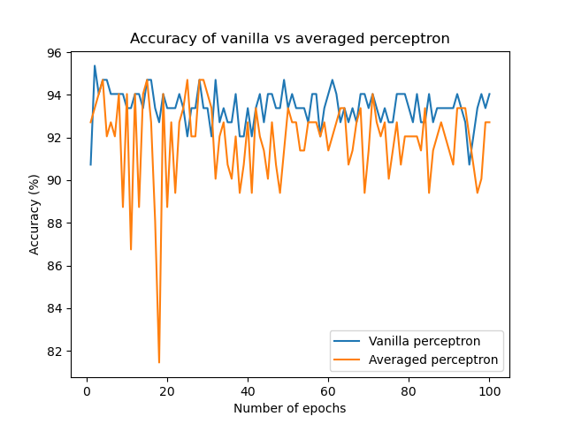

## Vanilla vs averaged perceptron

Using the [ionosphere dataset](https://archive.ics.uci.edu/ml/datasets/Ionosphere), we model a perceptron which determines a decision boundary of whether a radar pulse returns back to the ground or not.

Funnily enough, I've obtained better consistency with vanilla perceptron in contrast to the averaged one when it really should be reversed.
