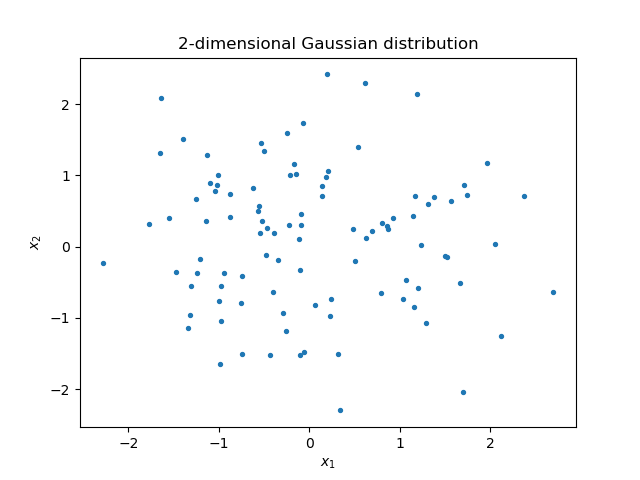

```python
import numpy as np
import matplotlib.pyplot as plt
```

### Question a
```python
mean = np.zeros(2)
covariance = np.identity(2)

x, y = np.random.multivariate_normal(mean, covariance, 100).T
plt.scatter(x, y, s=8)
plt.title("2-dimensional Gaussian distribution")
plt.xlabel("$x_1$")
plt.ylabel("$x_2$")
```



### Question b
```python
# The central mean point shifts to (-1,1) from origin
mean = np.array([-1,1])
covariance = np.identity(2)

x, y = np.random.multivariate_normal(mean, covariance, 100).T
plt.scatter(x, y, s=8)
plt.title("2-dimensional Gaussian distribution")
plt.xlabel("$x_1$")
plt.ylabel("$x_2$")
```


### Question c
```python
mean = np.zeros(2)
covariance = 2*np.identity(2)

x, y = np.random.multivariate_normal(mean, covariance, 100).T
plt.scatter(x, y, s=8)
plt.title("2-dimensional Gaussian distribution")
plt.xlabel("$x_1$")
plt.ylabel("$x_2$")
```


### Question d
```python
mean = np.zeros(2)
covariance = np.array([[1,0.5], [0.5,1]])

x, y = np.random.multivariate_normal(mean, covariance, 100).T
plt.scatter(x, y, s=8)
plt.title("2-dimensional Gaussian distribution")
plt.xlabel("$x_1$")
plt.ylabel("$x_2$")
```


### Question e
```python
mean = np.zeros(2)
covariance = np.array([[1,-0.5], [-0.5,1]])

x, y = np.random.multivariate_normal(mean, covariance, 100).T
plt.scatter(x, y, s=8)
plt.title("2-dimensional Gaussian distribution")
plt.xlabel("$x_1$")
plt.ylabel("$x_2$")
```


